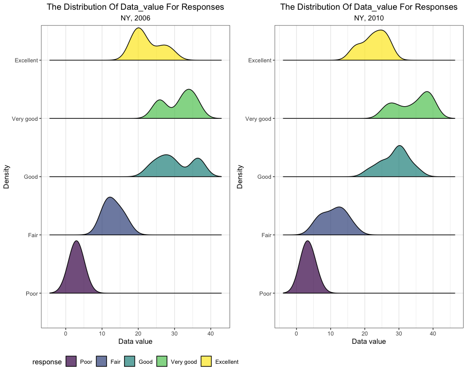
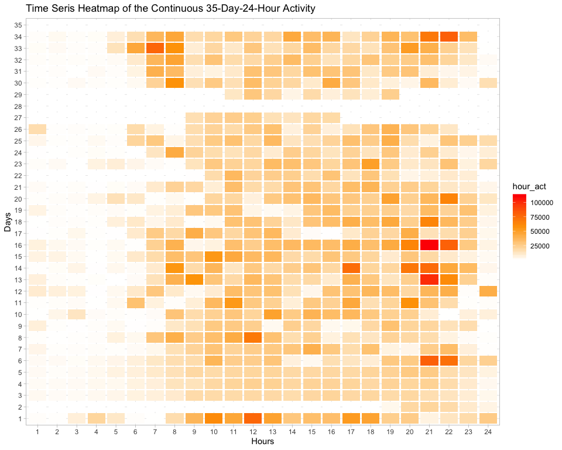

p8105\_hw3\_zl2860
================
Zongchao Liu
10/6/2019

# Problem 1

## load data

Let’s see a brief summary of this dataset

    ## Skim summary statistics
    ##  n obs: 1384617 
    ##  n variables: 15 
    ## 
    ## ── Variable type:character ──────────────────────────────────────────────────────────────────────────────────────────────────────────────
    ##      variable missing complete       n min max empty n_unique
    ##         aisle       0  1384617 1384617   3  29     0      134
    ##    department       0  1384617 1384617   4  15     0       21
    ##      eval_set       0  1384617 1384617   5   5     0        1
    ##  product_name       0  1384617 1384617   3 159     0    39123
    ## 
    ## ── Variable type:integer ────────────────────────────────────────────────────────────────────────────────────────────────────────────────
    ##                variable missing complete       n       mean        sd p0
    ##       add_to_cart_order       0  1384617 1384617       8.76      7.42  1
    ##                aisle_id       0  1384617 1384617      71.3      38.1   1
    ##  days_since_prior_order       0  1384617 1384617      17.07     10.43  0
    ##           department_id       0  1384617 1384617       9.84      6.29  1
    ##               order_dow       0  1384617 1384617       2.7       2.17  0
    ##       order_hour_of_day       0  1384617 1384617      13.58      4.24  0
    ##                order_id       0  1384617 1384617 1706297.62 989732.65  1
    ##            order_number       0  1384617 1384617      17.09     16.61  4
    ##              product_id       0  1384617 1384617   25556.24  14121.27  1
    ##               reordered       0  1384617 1384617       0.6       0.49  0
    ##                 user_id       0  1384617 1384617   1e+05     59487.15  1
    ##     p25     p50     p75    p100     hist
    ##       3       7      12      80 ▇▃▁▁▁▁▁▁
    ##      31      83     107     134 ▃▇▃▃▇▅▅▆
    ##       7      15      30      30 ▂▅▃▃▁▂▁▇
    ##       4       8      16      21 ▃▇▂▁▂▆▁▃
    ##       1       3       5       6 ▇▅▃▃▁▃▅▅
    ##      10      14      17      23 ▁▁▃▇▇▇▅▂
    ##  843370 1701880 2568023 3421070 ▇▇▇▇▇▇▇▇
    ##       6      11      21     100 ▇▂▁▁▁▁▁▁
    ##   13380   25298   37940   49688 ▆▆▇▇▇▆▇▇
    ##       0       1       1       1 ▆▁▁▁▁▁▁▇
    ##   51732   1e+05  154959  206209 ▇▇▇▇▇▇▇▇

The `instacart` dataset has 1384617 observations of 15 variables. The
brief summary of the data shows that the datatypes inclue both the
character and the integer. However, some of the variables are not in the
correct type for feature analysis(i.e. `*_id`), requiring cleaning based
on our need. Key variables include
`aisle`,`deaprment`,`product_name`,`order_dow`, `order_hour_of_day` and
others.

Illustrative examples of observation: e.g. The first row indicates that
the customer with id 112108 bought a Bulgarian Yogurt at `yogurt` aisle
from the `diary eggs` department. The id of the aisle is 120 and the id
of the deparmtent is 16. This product was ordered during the 10th hour
on the 4 th day of the week. Days since the last order are 9 and the
order sequence number for this user is 4 th. This prodcut has been
ordered by this user in the past. The evaluation set this order belongs
in is
`train`.

## Answer the questions:

### 1\. How many aisles are there, and which aisles are the most items ordered from?

``` r
instacart %>%
  summarise(number_of_aisles = n_distinct(aisle)) %>%
  pull(number_of_aisles)# 134 aisles
```

    ## [1] 134

``` r
instacart %>%
  group_by(aisle)%>%
  summarise(items_number = n()) %>%
  filter(items_number == max(items_number)) %>%
  pull(aisle)
```

    ## [1] "fresh vegetables"

Answer: There are 134 aisles and the most items are ordered from the
`fresh vegetables`
aisle.

### 2\. Make a plot that shows the number of items ordered in each aisle, limiting this to aisles with more than 10000 items ordered. Arrange aisles sensibly, and organize your plot so others can read it.


### 3\. Make a table showing the three most popular items in each of the aisles “baking ingredients”, “dog food care”, and “packaged vegetables fruits”. Include the number of times each item is ordered in your table.

| aisle                      | product\_name                                 | items\_number |
| :------------------------- | :-------------------------------------------- | ------------: |
| baking ingredients         | Light Brown Sugar                             |           499 |
| baking ingredients         | Pure Baking Soda                              |           387 |
| baking ingredients         | Cane Sugar                                    |           336 |
| dog food care              | Snack Sticks Chicken & Rice Recipe Dog Treats |            30 |
| dog food care              | Organix Chicken & Brown Rice Recipe           |            28 |
| dog food care              | Small Dog Biscuits                            |            26 |
| packaged vegetables fruits | Organic Baby Spinach                          |          9784 |
| packaged vegetables fruits | Organic Raspberries                           |          5546 |
| packaged vegetables fruits | Organic Blueberries                           |          4966 |

Table
1

### 4\. Make a table showing the mean hour of the day at which Pink Lady Apples and Coffee Ice Cream are ordered on each day of the week; format this table for human readers (i.e. produce a 2 x 7 table)

| product\_name    | Sunday | Monday | Tuesday | Wednesday | Thursday | Friday | Saturday |
| :--------------- | -----: | -----: | ------: | --------: | -------: | -----: | -------: |
| Coffee Ice Cream |   13.8 |   14.3 |    15.4 |      15.3 |     15.2 |   12.3 |     13.8 |
| Pink Lady Apples |   13.4 |   11.4 |    11.7 |      14.2 |     11.6 |   12.8 |     11.9 |

# Problem 2

## answer the questions:

### 1\. In 2002, which states were observed at 7 or more locations? What about in 2010?

| locationabbr | obs\_loc |
| :----------- | -------: |
| CT           |        7 |
| FL           |        7 |
| MA           |        8 |
| NC           |        7 |
| NJ           |        8 |
| PA           |       10 |

| locationabbr    | obs\_loc |
| :-------------- | -------: |
| CA              |       12 |
| CO              |        7 |
| FL              |       41 |
| MA              |        9 |
| MD              |       12 |
| NC              |       12 |
| NE              |       10 |
| NJ              |       19 |
| NY              |        9 |
| OH              |        8 |
| PA              |        7 |
| SC              |        7 |
| TX              |       16 |
| WA              |       10 |
| As the tables s |     how: |

In 2002, CT, FL, MA, NC, NJ, PA were observed at 7 or more locations.

In 2010, CA, CO, FL, MA, MD, NC, NE, NJ, NY, OH, PA, SC, TX, WA were
observed at 7 or more
locations.

### 2\. Construct a dataset that is limited to Excellent responses, and contains, year, state, and a variable that averages the data\_value across locations within a state. Make a “spaghetti” plot of this average value over time within a state (that is, make a plot showing a line for each state across years – the geom\_line geometry and group aesthetic will help).


From the plot above we can see that for most of the states, the average
`data_value`s are within the range of 17.5 ~ 27.5 and flutuate across
the
years.

### 3\. Make a two-panel plot showing, for the years 2006, and 2010, distribution of data\_value for responses (“Poor” to “Excellent”) among locations in NY State.


I also made another plot here to show the density of the `data_value`.
However, in this plot, the names of the counties are not specified. The
two plots respectively reflect different
information.

    ## Picking joint bandwidth of 2.1

    ## Picking joint bandwidth of 2.03



# problem 3

## Q1. Load, tidy, and otherwise wrangle the data.

    ## Parsed with column specification:
    ## cols(
    ##   .default = col_double(),
    ##   day = col_character()
    ## )

    ## See spec(...) for full column specifications.

The dataset `accel_data` has 35 observations of 1444, containing the
activity information in each minute of 35 days. Also, index of weeks and
days are shown by the dataset. Here, I rearrange the `day_id` so that
the values within this variable are matched with the day of the week,
which is an important preparation for future
analysis.

## Q2. Traditional analyses of accelerometer data focus on the total activity over the day. Using your tidied dataset, aggregate accross minutes to create a total activity variable for each day, and create a table showing these totals. Are any trends apparent?

| week | day       | total\_activity |
| :--- | :-------- | --------------: |
| 1    | Sunday    |       631105.00 |
| 1    | Monday    |        78828.07 |
| 1    | Tuesday   |       307094.24 |
| 1    | Wednesday |       340115.01 |
| 1    | Thursday  |       355923.64 |
| 1    | Friday    |       480542.62 |
| 1    | Saturday  |       376254.00 |
| 2    | Sunday    |       422018.00 |
| 2    | Monday    |       295431.00 |
| 2    | Tuesday   |       423245.00 |
| 2    | Wednesday |       440962.00 |
| 2    | Thursday  |       474048.00 |
| 2    | Friday    |       568839.00 |
| 2    | Saturday  |       607175.00 |
| 3    | Sunday    |       467052.00 |
| 3    | Monday    |       685910.00 |
| 3    | Tuesday   |       381507.00 |
| 3    | Wednesday |       468869.00 |
| 3    | Thursday  |       371230.00 |
| 3    | Friday    |       467420.00 |
| 3    | Saturday  |       382928.00 |
| 4    | Sunday    |       260617.00 |
| 4    | Monday    |       409450.00 |
| 4    | Tuesday   |       319568.00 |
| 4    | Wednesday |       434460.00 |
| 4    | Thursday  |       340291.00 |
| 4    | Friday    |       154049.00 |
| 4    | Saturday  |         1440.00 |
| 5    | Sunday    |       138421.00 |
| 5    | Monday    |       389080.00 |
| 5    | Tuesday   |       367824.00 |
| 5    | Wednesday |       445366.00 |
| 5    | Thursday  |       549658.00 |
| 5    | Friday    |       620860.00 |
| 5    | Saturday  |         1440.00 |


Since there are 35 days(the table has too many rows), the table is hard
to directly show the trends. Therefore, I add a plot here. From the plot
above, which is derived from the table, it is easy to find that the
activity of the man on Sundays is keeping decreasing. Also, There is a
peak of the activity on the Monday of the third week and a peak of the
weekly activity in the third week. Obviously, the activity on Saturdays
of the fourth and the fith week is too low to see on the plot. I have
checked the data of these two days on the table, and find that the
values are actually very low. There should be some reasons to explain
this
situation.

## Q3. Accelerometer data allows the inspection activity over the course of the day. Make a single-panel plot that shows the 24-hour activity time courses for each day and use color to indicate day of the week. Describe in words any patterns or conclusions you can make based on this graph.


I made two plots here trying to show the trends.

Firstly I made an area plot to show the trends of the activity of the 35
days in every minute of a day. From the first plot, we can see that
differences of activity do exist between different days. Some of the
days have higher activity levels than the others. The most important
information we can get from this plot is that the activity of nearly all
of the 35 days follow a visible trend across the 24 hours. On each day,
the activity keeps increasing before the 7th hour, and then fluctuates
from the 7th hour to the 21 st hour. After that, the activity decreases
again. If the order of the hours is matched with real time, the result
will be more believable because it does relect a normal daily life.

Secondly, I madd a time-series heatmap to show the trend of the 24-hour
activity. This plot is different from the first plot because it just
shows the activity of every hour rather than every minute of a day. We
can get the similar conclusion: the activity keeps increasing before the
7th hour and then fluctuates from the 7th hour to the 21 st hour. After
that, it dramatically decreases. However, We can also know something new
in this plot. The distributions of the activity peaks in each day are
different. Some days have two peaks, some have only one, and others have
none. Obviously, from the plot we see some days have very low activity.
I have checked the activity of those days in the dataset and find that
for most of the minutes within those days, the activity per minute is
only “1”. There are many reasons to explain that. Perhaps it’s because
the device failed to record data at that time and only returned the
activity value as
    “1”.

    ## Scale for 'fill' is already present. Adding another scale for 'fill',
    ## which will replace the existing scale.


