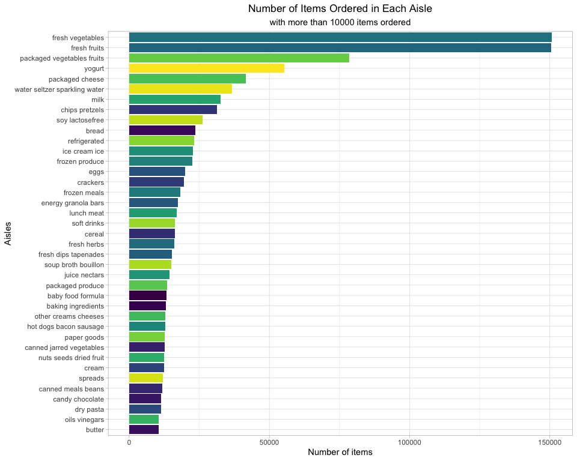
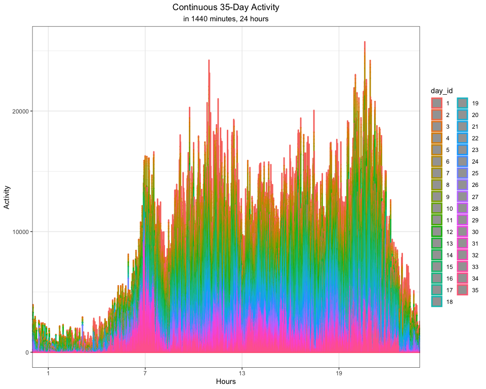

p8105\_hw3\_zl2860
================
Zongchao Liu UNI:zl2860
10/6/2019

# Problem 1

## Load data

Let’s see a brief summary of this dataset first:

``` r
#load data for problem 1 
data("instacart") #load data
skimr::skim(instacart) # a brief summary
```

    ## Skim summary statistics
    ##  n obs: 1384617 
    ##  n variables: 15 
    ## 
    ## ── Variable type:character ──────────────────────────────────────────────────────────────────────────────────────────
    ##      variable missing complete       n min max empty n_unique
    ##         aisle       0  1384617 1384617   3  29     0      134
    ##    department       0  1384617 1384617   4  15     0       21
    ##      eval_set       0  1384617 1384617   5   5     0        1
    ##  product_name       0  1384617 1384617   3 159     0    39123
    ## 
    ## ── Variable type:integer ────────────────────────────────────────────────────────────────────────────────────────────
    ##                variable missing complete       n       mean        sd p0
    ##       add_to_cart_order       0  1384617 1384617       8.76      7.42  1
    ##                aisle_id       0  1384617 1384617      71.3      38.1   1
    ##  days_since_prior_order       0  1384617 1384617      17.07     10.43  0
    ##           department_id       0  1384617 1384617       9.84      6.29  1
    ##               order_dow       0  1384617 1384617       2.7       2.17  0
    ##       order_hour_of_day       0  1384617 1384617      13.58      4.24  0
    ##                order_id       0  1384617 1384617 1706297.62 989732.65  1
    ##            order_number       0  1384617 1384617      17.09     16.61  4
    ##              product_id       0  1384617 1384617   25556.24  14121.27  1
    ##               reordered       0  1384617 1384617       0.6       0.49  0
    ##                 user_id       0  1384617 1384617   1e+05     59487.15  1
    ##     p25     p50     p75    p100     hist
    ##       3       7      12      80 ▇▃▁▁▁▁▁▁
    ##      31      83     107     134 ▃▇▃▃▇▅▅▆
    ##       7      15      30      30 ▂▅▃▃▁▂▁▇
    ##       4       8      16      21 ▃▇▂▁▂▆▁▃
    ##       1       3       5       6 ▇▅▃▃▁▃▅▅
    ##      10      14      17      23 ▁▁▃▇▇▇▅▂
    ##  843370 1701880 2568023 3421070 ▇▇▇▇▇▇▇▇
    ##       6      11      21     100 ▇▂▁▁▁▁▁▁
    ##   13380   25298   37940   49688 ▆▆▇▇▇▆▇▇
    ##       0       1       1       1 ▆▁▁▁▁▁▁▇
    ##   51732   1e+05  154959  206209 ▇▇▇▇▇▇▇▇

The `instacart` dataset has `1384617` observations of `15` variables.
The brief summary of the data shows that the data type within this
dataset inclues both the character and the integer. However, some of the
variables are not in the correct type for future analysis(e.g. `*_id`),
requiring adjustment based on our need. Key variables in this dataset
include `aisle`,`deaprment`,`product_name`,`order_dow`,
`order_hour_of_day` and others.

Illustrative examples of observation:

The first row of the data indicates that the customer with id `112108`
bought a `Bulgarian Yogurt` at `yogurt` aisle from the `dairy eggs`
department. The id of the aisle is `120` and the id of the deparmtent is
`16`. This product was ordered during the `10th hour` on the `4 th day`
of the week. Days since the last order are `9` and the order sequence
number for this user is `4 th`. This prodcut has been ordered by this
user in the past. The evaluation set this order belongs in is `train`.

The second row of the data indicates that the customer with id `112108`
bought an `Organic 4% Milk Fat Whole Milk Cottage Cheese` at `other
creams cheeses` aisle from the `dairy eggs` department. The id of the
aisle is `108` and the id of the deparmtent is `16`. This product was
ordered during the `10th hour` on the `4 th day` of the week. Days since
the last order are `9` and the order sequence number for this user is `4
th`. This prodcut has been ordered by this user in the past. The
evaluation set this order belongs in is
`train`.

## Do or answer the following:

### 1\. How many aisles are there, and which aisles are the most items ordered from?

``` r
instacart %>%
  summarise(number_of_aisles = n_distinct(aisle)) %>%
  pull(number_of_aisles)# 134 aisles
```

    ## [1] 134

``` r
instacart %>%
  group_by(aisle) %>%
  summarise(items_number = n()) %>%
  arrange(desc(items_number)) %>%
  head(5) %>%
  knitr::kable()
```

| aisle                      | items\_number |
| :------------------------- | ------------: |
| fresh vegetables           |        150609 |
| fresh fruits               |        150473 |
| packaged vegetables fruits |         78493 |
| yogurt                     |         55240 |
| packaged cheese            |         41699 |

There are 134 aisles and the top 5 aisles from which the most items are
ordered are `fresh vegetables`, `fresh fruits`, `packaged vegetables
fruits`, `yogurt`, `packaged
cheese`.

### 2\. Make a plot that shows the number of items ordered in each aisle, limiting this to aisles with more than 10000 items ordered. Arrange aisles sensibly, and organize your plot so others can read it.

``` r
instacart %>%
  group_by(aisle) %>%
  summarise(items_number = n()) %>%
  filter(items_number > 10000) %>%
  ggplot(aes(x = reorder(aisle, items_number), 
             y = items_number, fill = aisle)) +
  geom_col() +
  viridis::scale_fill_viridis(option = "viridis" , discrete = TRUE) +
  labs(
    title = "Number of Items Ordered in Each Aisle",
    subtitle = "with more than 10000 items ordered",
    x = "Aisles",
    y = "Number of items"
  ) +
  theme_light() +
  theme(plot.title = element_text(hjust = 0.5),
        plot.subtitle = element_text(hjust = 0.5)) +
  theme(legend.position = "none") +
  coord_flip()
```



In total, there are 39 aisles with more than 10000 items ordered. Among
all of these aisles, the number of items ordered at `fresh vegetables`,
`fresh fruits`, `packaged vegetables fruits` ranks No.1 ~ 3, while the
number of items ordered at `butter` is the
least.

### 3\. Make a table showing the three most popular items in each of the aisles “baking ingredients”, “dog food care”, and “packaged vegetables fruits”. Include the number of times each item is ordered in your table.

#### Table 1. Three Most Popular Items in Each of the Three Aisles

#### (“baking ingredients”, “dog food care”, and “packaged vegetables fruits”)

``` r
three_aisles <- 
  instacart %>%
  filter(aisle == "baking ingredients" |
         aisle == "dog food care" |
         aisle == "packaged vegetables fruits") %>%
  group_by(aisle, product_name) %>%
  summarise(times_ordered = n())

baking_ingredients<- 
  three_aisles %>%
  filter(aisle == "baking ingredients") %>%
  arrange(desc(times_ordered)) %>%
  head(3) 

dog_food_care<- 
  three_aisles %>%
  filter(aisle == "dog food care") %>%
  arrange(desc(times_ordered)) %>%
  head(3)

packaged_vegetables_fruits<- 
  three_aisles %>%
  filter(aisle == "packaged vegetables fruits") %>%
  arrange(desc(times_ordered)) %>%
  head(3)

  bind_rows(baking_ingredients, dog_food_care) %>%
  bind_rows(packaged_vegetables_fruits) %>%
  knitr::kable()
```

| aisle                      | product\_name                                 | times\_ordered |
| :------------------------- | :-------------------------------------------- | -------------: |
| baking ingredients         | Light Brown Sugar                             |            499 |
| baking ingredients         | Pure Baking Soda                              |            387 |
| baking ingredients         | Cane Sugar                                    |            336 |
| dog food care              | Snack Sticks Chicken & Rice Recipe Dog Treats |             30 |
| dog food care              | Organix Chicken & Brown Rice Recipe           |             28 |
| dog food care              | Small Dog Biscuits                            |             26 |
| packaged vegetables fruits | Organic Baby Spinach                          |           9784 |
| packaged vegetables fruits | Organic Raspberries                           |           5546 |
| packaged vegetables fruits | Organic Blueberries                           |           4966 |

In the `baking ingredients` aisle, `Light Brown Sugar`, `Pure Baking
Soda`, `Cane Sugar` are the most three popular items (with 499, 387, 336
ordered times respectively).

In the `dog food care` aisle, `Snack Sticks Chicken & Rice Recipe Dog
Treats`,`Organix Chicken & Brown Rice Recipe`,`Small Dog Biscuits` are
the most three popular items (with 30, 28, 26 ordered times
respectively).

In the `packaged vegetables fruits` aisle, `Organic Baby Spinach`,
`Organic Raspberries`, `Organic Blueberries` are the most three popular
items (with 9784, 5546, 4966 ordered times
respectively).

### 4\. Make a table showing the mean hour of the day at which Pink Lady Apples and Coffee Ice Cream are ordered on each day of the week; format this table for human readers (i.e. produce a 2 x 7 table)

#### Table 2. The Mean Hour of the Day at Which Pink Lady Apples and Coffee Ice Cream Are Ordered

``` r
days <- c("Sunday", "Monday","Tuesday","Wednesday","Thursday","Friday","Saturday")

instacart %>%
  filter( product_name == "Pink Lady Apples" | 
          product_name == "Coffee Ice Cream") %>%
  select(order_dow, order_hour_of_day, product_name) %>%
  mutate(order_dow = recode(order_dow, 
         "0" = "Sunday", 
         "1" = "Monday",
         "2" = "Tuesday",
         "3" = "Wednesday",
         "4" = "Thursday",
         "5" = "Friday",
         "6" = "Saturday"),
         order_dow = factor(order_dow, levels = days)) %>%
  group_by(order_dow, product_name) %>%
  summarize(mean_hour = round(mean(order_hour_of_day), 
                              digits = 1)
            ) %>%
  pivot_wider(names_from = order_dow,
              values_from = mean_hour) %>%
  knitr::kable()
```

| product\_name    | Sunday | Monday | Tuesday | Wednesday | Thursday | Friday | Saturday |
| :--------------- | -----: | -----: | ------: | --------: | -------: | -----: | -------: |
| Coffee Ice Cream |   13.8 |   14.3 |    15.4 |      15.3 |     15.2 |   12.3 |     13.8 |
| Pink Lady Apples |   13.4 |   11.4 |    11.7 |      14.2 |     11.6 |   12.8 |     11.9 |

The values in the table indicate the mean hour of the day on which the
order was placed. The mean of `order_hour_of_day` of `Coffee Ice Cream`
is greater than that of `Pink Lady Apples` on almost each day. While the
mean hour of `Pink Lady Apples` is fluctuating across the week, the mean
hour of `Coffee Ice Cream` has a more clear trend, which is increasing
from Sunday to Wednesday and decreasing from Thursday to Saturday.

# Problem 2

## Data Cleaning

``` r
data("brfss_smart2010")#load data

#data cleaning
BRFSS <- 
  brfss_smart2010 %>% #brfss_smart2010 exists in the package "p8105.datasets"
  janitor::clean_names() %>%
  filter(topic == "Overall Health") %>% #focus on the “Overall Health” 
  filter(response == "Excellent" |
         response ==  "Good" |
         response == "Very good" |
         response == "Fair" |
         response == "Poor"
         ) %>% #include only responses from “Excellent” to “Poor”
  mutate(response = factor(response, levels = c("Poor", "Fair", "Good", "Very good", "Excellent"))) #organize responses as a factor taking levels ordered from “Poor” to “Excellent”
```

## Answer the questions:

### 1\. In 2002, which states were observed at 7 or more locations? What about in 2010?

``` r
states2002 <-
  BRFSS %>%
  filter(year == 2002) %>% #filter year
  group_by(locationabbr) %>%
  distinct(locationdesc) %>% #multiple observations at the same location are treated as 1 observation
  summarize(obs_loc = n()) %>% #count
  filter(obs_loc >= 7) 

states2002 %>%
  knitr::kable()
```

| locationabbr | obs\_loc |
| :----------- | -------: |
| CT           |        7 |
| FL           |        7 |
| MA           |        8 |
| NC           |        7 |
| NJ           |        8 |
| PA           |       10 |

``` r
states2010 <-
  BRFSS %>%
  filter(year == 2010) %>%
  group_by(locationabbr) %>%
  distinct(locationdesc) %>% # multiple observations at the same location are treated as 1 observation
  summarize(obs_loc = n()) %>% #count
  filter(obs_loc >= 7) 

states2010 %>%
  knitr::kable()
```

| locationabbr | obs\_loc |
| :----------- | -------: |
| CA           |       12 |
| CO           |        7 |
| FL           |       41 |
| MA           |        9 |
| MD           |       12 |
| NC           |       12 |
| NE           |       10 |
| NJ           |       19 |
| NY           |        9 |
| OH           |        8 |
| PA           |        7 |
| SC           |        7 |
| TX           |       16 |
| WA           |       10 |

As the tables show:

In 2002, `CT, FL, MA, NC, NJ, PA` were observed at 7 or more locations.

In 2010, `CA, CO, FL, MA, MD, NC, NE, NJ, NY, OH, PA, SC, TX, WA` were
observed at 7 or more
locations.

### 2\. Construct a dataset that is limited to Excellent responses, and contains, year, state, and a variable that averages the data\_value across locations within a state. Make a “spaghetti” plot of this average value over time within a state.

``` r
BRFSS %>%
  filter(response == "Excellent") %>% #limited to Excellent responses
  group_by(locationabbr, year) %>%  #contains year, state
  mutate(avg_data_value = mean(data_value)) %>% 
  select(year, locationabbr, avg_data_value) %>% #create a variable that averages the data_value across locations within a state
  distinct() %>%
  ggplot(aes(x = year , y = avg_data_value, color = locationabbr, group = locationabbr)) +
  geom_line() + 
  viridis::scale_color_viridis(discrete = TRUE) +
  theme_bw() +
  labs(
    title = "Spaghetti Plot of the Average Value Over Time Within a State",
    x = "Year",
    y = "Average data value"
  ) +
  theme(
    plot.title = element_text(hjust = .5)
  )
```


From the plot above we see that for most of the states, the average
`data_value`s are within the range of 17.5 ~ 27.5 and fluctuate across
the years. Since there are so many states within the single plot, trends
are hard to be clearly
identified.

### 3\. Make a two-panel plot showing, for the years 2006, and 2010, distribution of data\_value for responses (“Poor” to “Excellent”) among locations in NY State.

``` r
# distribution with counties
#plot for 2006
plot_2006 <-
  BRFSS %>%
  filter(year == 2006,
         locationabbr =="NY") %>%
  ggplot(aes(x = locationdesc,
             y = data_value,
             group = response,
             color = response)) +
  geom_point(aes(size = data_value),
                 alpha = .7) +
  geom_line() +
  theme_bw() +
  labs(
    title = "Distribution of `data_value` for Responses",
    subtitle = "2006 in NY State",
    x = "Counties",
    y = "Data value"
  ) +
  theme(legend.position = "bottom") +
  theme(plot.title = element_text(hjust = 0.5), 
        plot.subtitle = element_text(hjust = 0.5),
        legend.position = "bottom", 
        axis.text.x = element_text(angle = 90, hjust = 0.5, vjust = 0.5))

#plot for 2010
plot_2010 <-
  BRFSS %>%
  filter(year == 2010,
         locationabbr == "NY") %>%
  ggplot(aes(x = locationdesc,
             y = data_value,
             group = response,
             color = response)) +
  geom_point(aes(size = data_value),
                 alpha = .7) +
  geom_line() +
  theme_bw() +
  labs(
    title = "Distribution of `data_value` for Responses",
    subtitle = "2010 in NY State",
    x = "Counties",
    y = "Data value"
  ) +
  theme(legend.position = "none") +
  theme(plot.title = element_text(hjust = 0.5), 
        plot.subtitle = element_text(hjust = 0.5),
        legend.position = "none", 
        axis.text.x = element_text(angle = 90, hjust = 0.5, vjust = 0.5))

plot_2006 + plot_2010
```


From the plot above, we see that `Good` and `Very good` responses always
have highest data values compared to other responses. In addition, it’s
easy to identify the `Poor` and `Fair` responses as they have relatively
low data values within different ranges. Data values of the `Excellent`
responses are almost on the middle level among locations in NY State in
both 2 years. I also made another plot here to show the density of the
`data_value`. In this plot, the names of the counties are not specified.
However, it makes up some of the information that is not reflected by
the first plot.

``` r
# distribution without counties
plot_2006_density <- 
  BRFSS %>%
  filter(year == 2006,
         locationabbr == "NY") %>%
  select(year, response, data_value)  %>%
  ggplot(aes(x =data_value,
             y = response,
             fill = response)) + 
  geom_density_ridges2 (scale = .9,
                       alpha = .7) +
  theme_bw() +
  labs(
    title = str_to_title("Distribution of `data_value` for Responses"),
    subtitle = "NY, 2006",
    x = "Data value",
    y = "Density"
  ) +
  theme(legend.position = "bottom"  ) +
  viridis::scale_fill_viridis(discrete = TRUE) +
  theme(
    plot.title = element_text(hjust = .5),
    plot.subtitle = element_text(hjust = .5)
  )

plot_2010_density <-
  BRFSS %>%
  filter(year == 2010,
         locationabbr == "NY") %>%
  select(year, response, data_value)  %>%
  ggplot(aes(x =data_value,
             y = response,
             fill = response)) + 
  geom_density_ridges2(scale = 0.9,
                       alpha = .7) +
  theme_bw() +
  labs(
    title = str_to_title("Distribution of `data_value` for Responses"),
    subtitle = "NY, 2010",
    x = "Data value",
    y = "Density"
  ) +
  theme(legend.position = "none"  ) +
  viridis::scale_fill_viridis(discrete = TRUE) +
  theme(
    plot.title = element_text(hjust = .5),
    plot.subtitle = element_text(hjust = .5)
  )

plot_2006_density + plot_2010_density
```


# Problem 3

## Q1. Load, tidy, and otherwise wrangle the data.

``` r
#load and clean data
day_ind <-
  seq(1,29,7) # create a vector for easily adjusting `day_id` later

accel_data <- 
  read_csv("./dataset/accel_data.csv") %>%
  janitor::clean_names() %>%
  mutate(weekday_vs_weekend = ifelse(day == "Saturday" | day == "Sunday", 
                                     "weekend", "weekday"), #include a weekday vs weekend variable
         day = factor(day, 
                      levels = c("Sunday", "Monday", "Tuesday", "Wednesday", "Thursday", "Friday", "Saturday")
                      )
         )  %>%  # change the data type of `day` so that we can rearrange the `day_id`
  arrange(day) %>%
  mutate(
  day_id = c(day_ind, 
             day_ind + 1, 
             day_ind + 2,
             day_ind + 3,
             day_ind + 4,
             day_ind + 5,
             day_ind + 6)  # match `day_id` with the order of the 35 days in a human friendly way
  ) %>%
  arrange(week) #check if the `day_id` is correctly adjusted
```

The dataset `accel_data` has 35 observations of 1444, containing the
activity information in each minute of 35 days. Also, indexes of weeks
and days are shown by the dataset. Here, I rearrange the `day_id` so
that the values within this variable are matched with the day of the
week, which is an important preparation for future
analysis.

## Q2. Traditional analyses of accelerometer data focus on the total activity over the day. Using your tidied dataset, aggregate accross minutes to create a total activity variable for each day, and create a table showing these totals. Are any trends apparent?

### Table 3. Total Activity Variable for Each Day

``` r
# calculate total activity of a day
act_trend <-
  accel_data %>%
  mutate( day = day,
          week = as.character(week)) %>%
  pivot_longer( activity_1 : activity_1440,
                names_to = "min",
                values_to = "min_activity",
               ) %>%
  group_by(week, day) %>%
  summarise(total_activity = sum(min_activity)) #aggregate accross minutes to create a total activity variable for each day

act_trend %>%
  pivot_wider(names_from = day,
              values_from = total_activity) %>%
  knitr::kable() # show table
```

| week | Sunday |    Monday |  Tuesday | Wednesday | Thursday |   Friday | Saturday |
| :--- | -----: | --------: | -------: | --------: | -------: | -------: | -------: |
| 1    | 631105 |  78828.07 | 307094.2 |    340115 | 355923.6 | 480542.6 |   376254 |
| 2    | 422018 | 295431.00 | 423245.0 |    440962 | 474048.0 | 568839.0 |   607175 |
| 3    | 467052 | 685910.00 | 381507.0 |    468869 | 371230.0 | 467420.0 |   382928 |
| 4    | 260617 | 409450.00 | 319568.0 |    434460 | 340291.0 | 154049.0 |     1440 |
| 5    | 138421 | 389080.00 | 367824.0 |    445366 | 549658.0 | 620860.0 |     1440 |

``` r
act_trend %>%
  ggplot(aes(x = week, 
             y = total_activity, 
             fill = day)) + 
  geom_col() +
  theme_bw() +
  labs(
    title = "Trends of the Total Activity in 5 Weeks",
    x = "Week",
    y = "Total Activity"
  ) +
  theme(
    plot.title = element_text(hjust = 0.5)
  )
```


Since there are 35 days (with many values), the table is hard to
directly show the trends. Therefore, I add a plot here. From the plot
which is derived from the table, it is easy to find that the activity of
the man on Sundays is keeping decreasing. Also, There is a peak of the
Monday’s activity during the third week and a peak of weekly activity in
the third week. Obviously, the activity on Saturdays of the fourth and
the fith week is too low to see on the plot. I have checked the data of
these two days in the table, and find that the values are actually very
low. There should be some reasons to explain this situation. Perhaps
it’s because the device failed to record data at that time and only
returned the activity value as
“1”.

## Q3. Accelerometer data allows the inspection activity over the course of the day. Make a single-panel plot that shows the 24-hour activity time courses for each day and use color to indicate day of the week. Describe in words any patterns or conclusions you can make based on this graph.

``` r
# final_plot_1
accel_data %>%
  mutate(day_id = factor(day_id)) %>%
  pivot_longer(
    activity_1:activity_1440,
    names_to = "min",
    names_prefix = "activity_",
    values_to = "min_activity"
  ) %>%
  mutate(min = factor(min, levels = c(1:1440))) %>%
  ggplot(aes(x = min, 
             y =min_activity, 
             color = day_id)) +
  geom_area(size = 1, alpha = .5) +
  scale_x_discrete(breaks = seq(60, 1440, (1440 / 4)),
                   labels = c("1", "7", "13", "19")) +  # adjust x-axis
  theme(axis.text.x = element_text(angle = 0))  +
  theme_bw() +
  labs(
    title = "Continuous 35-Day Activity",
    subtitle  = "in 1440 minutes, 24 hours",
    x = "Hours",
    y = "Activity"
  ) +
  theme(plot.title = element_text(hjust = 0.5),
        plot.subtitle = element_text(hjust = 0.5))
```



``` r
# time series heatmap
accel_data %>%
  mutate(day_id = factor(day_id)) %>%
  pivot_longer(
    activity_1:activity_1440,
    names_to = "min",
    names_prefix = "activity_",
    values_to = "min_activity"
  ) %>%
  group_by(day_id) %>%
  mutate(min = as.numeric(min),
         hour = ceiling(min / 60) #convert minutes to hours
         ) %>%
  group_by(day_id, hour, week, day) %>%
  summarise(hour_act = sum(min_activity)) %>% # calculate the hour_activity
  mutate(day_of_week = day) %>% ## reaarange
  ggplot(aes(x = as.factor(hour),
             y = day_id)
         ) +
  geom_tile(aes(fill = hour_act,
                width = 0.9,
                height = 0.9,
                ), 
            size = 2.5) +
  viridis::scale_fill_viridis() +
  scale_fill_gradientn(colors = c("white","orange","red")) +  
  scale_x_discrete(breaks = c(1:24),
                   labels = as.character(c(1:24)) #24 hours, 24 breaks
                   ) +
  labs(title = "Time-Series Heatmap of the Continuous 35-Day-24-Hour Activity",
       x = "Hours",
       y = "Days") +
  theme_light() +
  theme(plot.title = element_text(hjust = 0.5))
```


I made two plots here trying to show the trends.

Firstly I made an area plot to show the trends of the activity of the 35
days in every minute of a day. From the first plot, we see that
differences of activity do exist between different days. Some of the
days have higher activity levels than the others. The most important
information we can get from this plot is that the activity of nearly all
of the 35 days follow a visible trend across the 24 hours. On each day,
the activity keeps increasing before the 7th hour, and then fluctuates
from the 7th hour to the 21 st hour. After that, the activity decreases
again. If the order of the hours is matched with real time, the result
will be more believable because it does relect a normal human daily
life.

Secondly, I add a time-series heatmap to show the trend of the 24-hour
activity. This plot is different from the first plot as it just shows
the activity of every hour rather than every minute of a day. We can get
the similar conclusion: the activity keeps increasing before the 7th
hour and then fluctuates from the 7th hour to the 21 st hour. After
that, it dramatically decreases. In addition, We can also know something
new from this plot. The distributions of the activity peaks on each day
are different. Some days have two peaks, some have only one, and others
have none. Obviously, from the plot we see some days have very low
activity (white boxes). I have checked the activity of those days in the
dataset and find that for most of the minutes within those days, the
activity per minute is only “1”. There are many reasons to explain that.
Perhaps it’s because the device failed to record data at that time and
only returned the activity value as “1”.
